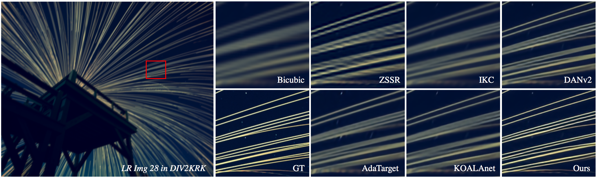
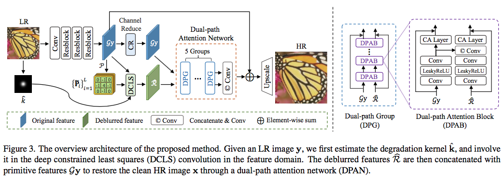
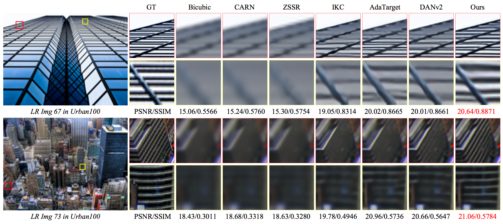
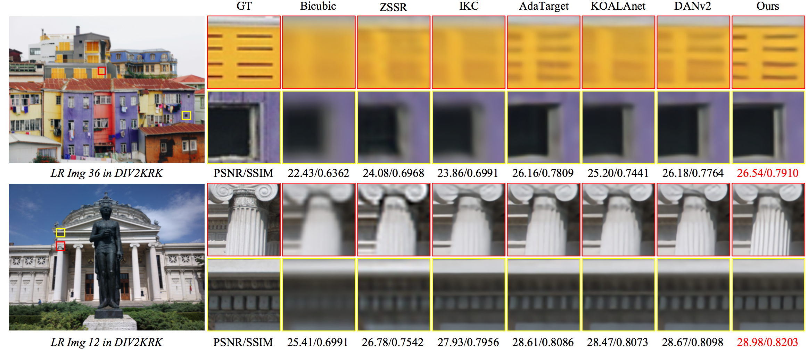

## [CVPR2022] Deep Constrained Least Squares for Blind Image Super-Resolution

<h4 align="center">Ziwei Luo<sup>1</sup>, Haibin Huang<sup>2</sup>, Lei Yu<sup>1</sup>, Youwei Li<sup>1</sup>, Haoqiang Fan<sup>1</sup>, Shuaicheng Liu<sup>3</sup></center>
<h4 align="center">1. Megvii Research, 2. Kuaishou Technology</center>
<h4 align="center">3. University of Electronic Science and Technology of China</center> <br><br>


[](https://paperswithcode.com/sota/blind-super-resolution-on-div2krk-2x?p=deep-constrained-least-squares-for-blind) [](https://paperswithcode.com/sota/blind-super-resolution-on-div2krk-4x?p=deep-constrained-least-squares-for-blind)
 


#### This is the official implementation of 'Deep Constrained Least Squares for Blind Image Super-Resolution', CVPR 2022. [[Paper](https://openaccess.thecvf.com/content/CVPR2022/papers/Luo_Deep_Constrained_Least_Squares_for_Blind_Image_Super-Resolution_CVPR_2022_paper.pdf)]   


### Updates
[**2022.04.22**] 🎉🎉🎉 Our work **BSRT** won the 1st place in NTIRE 2022 BurstSR Challenge [[Paper]](https://arxiv.org/abs/2204.08332)[[Code]](https://github.com/Algolzw/BSRT).     
[**2022.03.09**] We released the code and provided the **pretrained model weights** [[here]](https://drive.google.com/drive/folders/135xCCLWSylBaNxh6B3I_UnCeox8AkVzC?usp=sharing).  
[**2022.03.02**] Our paper has been accepted by CVPR 2022.




## Overview



## Presentation Video:
[[Youtube](https://www.youtube.com/watch?v=emXK78ckY_4)], [[Bilibili](https://www.bilibili.com/video/BV1cv4y1A7QL/)] 


## Dependenices

* OS: Ubuntu 18.04
* nvidia :
	- cuda: 10.1
	- cudnn: 7.6.1
* python3
* pytorch >= 1.6
* Python packages: numpy opencv-python lmdb pyyaml


## Dataset Preparation

We use DIV2K and Flickr2K as our training datasets (totally 3450 images). 

To transform datasets to binary files for efficient IO, run:

```bash
python3 codes/scripts/create_lmdb.py
```

For evaluation of Isotropic Gaussian kernels (Gaussian8), we use five datasets, i.e., Set5, Set14, Urban100, BSD100 and Manga109.

To generate LRblur/LR/HR/Bicubic datasets paths, run:

```bash
python3 codes/scripts/generate_mod_blur_LR_bic.py
```

For evaluation of Anisotropic Gaussian kernels, we use DIV2KRK.

(You need to modify the file paths by yourself.)

## Train
1. The core algorithm is in ``codes/config/DCLS``. 
2. Please modify `` codes/config/DCLS/options `` to set path, iterations, and other parameters...
3. To train the model(s) in the paper, run below commands.

For single GPU:

```bash
cd codes/config/DCLS
python3 train.py -opt=options/setting1/train_setting1_x4.yml
```

For distributed training

```bash
cd codes/config/DCLS
python3 -m torch.distributed.launch --nproc_per_node=4 --master_poer=4321 train.py -opt=options/setting1/train_setting1_x4.yml --launcher pytorch
```
Or choose training options use

```
cd codes/config/DCLS
sh demo.sh
```

## Evaluation
To evalute our method, please modify the benchmark path and model path and run

```bash
cd codes/config/DCLS
python3 test.py -opt=options/setting1/test_setting1_x4.yml
```

## Results

#### Comparison on Isotropic Gaussian kernels (Gaussian8)


#### Comparison on Anisotropic Gaussian kernels (DIV2KRK)



## Citations
If our code helps your research or work, please consider citing our paper.
The following is a BibTeX reference.

```
@inproceedings{luo2022deep,
  title={Deep constrained least squares for blind image super-resolution},
  author={Luo, Ziwei and Huang, Haibin and Yu, Lei and Li, Youwei and Fan, Haoqiang and Liu, Shuaicheng},
  booktitle={Proceedings of the IEEE/CVF Conference on Computer Vision and Pattern Recognition},
  pages={17642--17652},
  year={2022}
}
```

## Contact
email: [ziwei.ro@gmail.com]

## Acknowledgement
This project is based on [[DAN](https://github.com/greatlog/DAN)], [[MMSR](https://github.com/open-mmlab/mmediting)] and [[BasicSR](https://github.com/xinntao/BasicSR)].
